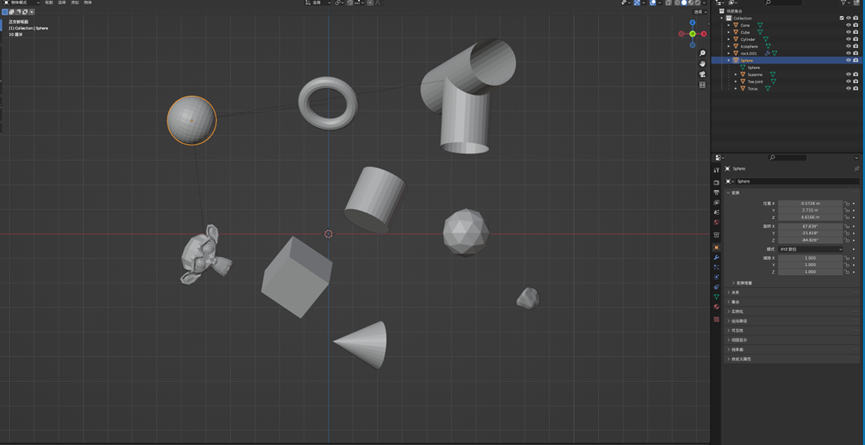
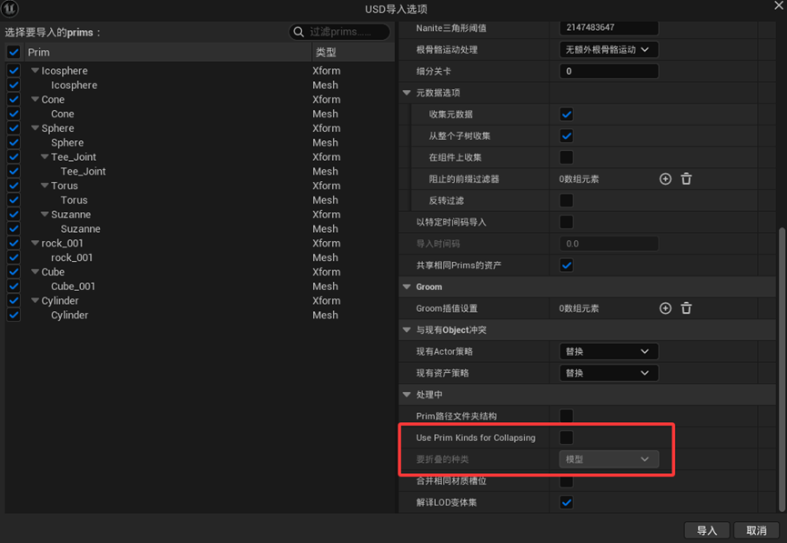
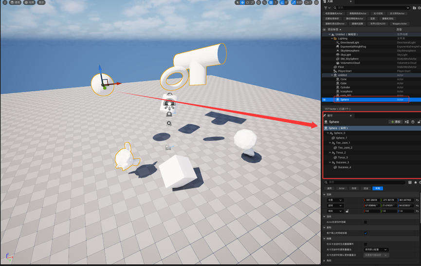
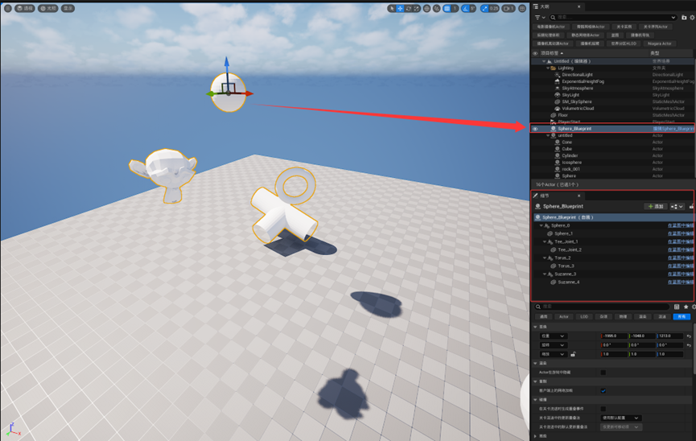
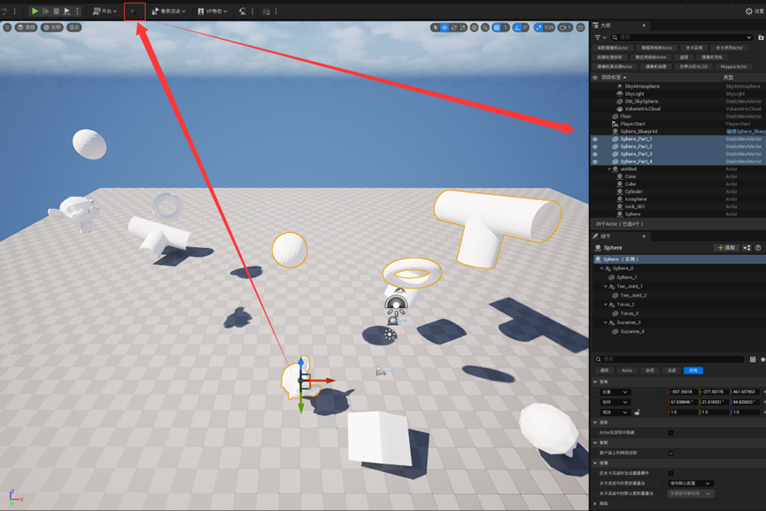
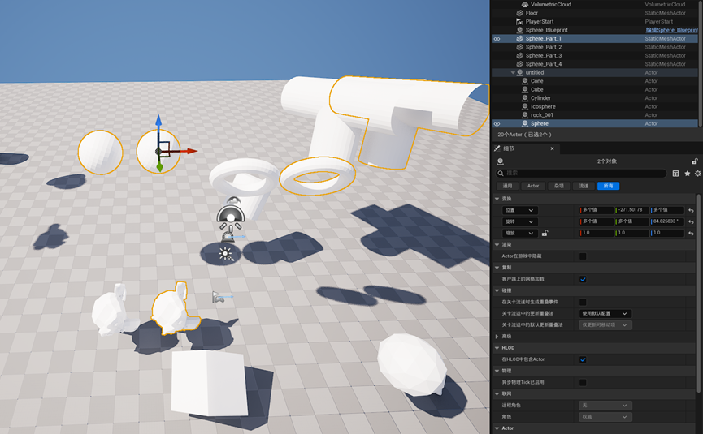
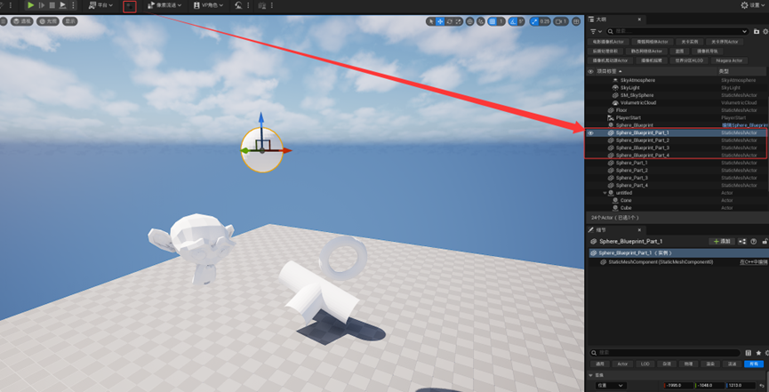
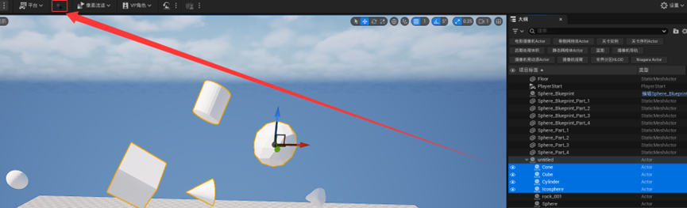

# SceneActorBreaker

本插件主要解决 DCC  软件 Blender 导出 usd 通过 UE-USDImporter 导入关卡时产生的场景Mesh层级嵌套结构问题。当导入的 USD 文件在 UE  中生成包含复杂父子级关系的场景 Actor 时，本插件能够将这些组合 Actor 中的各个 StaticMesh 组件拆分为独立的  Actor，同时完美保持原有的变换关系。一

## 安装方法

1. 将插件文件夹复制到您的项目的 `Plugins/` 目录下
2. 在编辑器中启用插件：**编辑** → **插件** → 搜索 "SceneActorBreaker"

## 使用方法

### 快速使用

1. 在场景中选择一个或多个包含多个静态网格组件的 Actor
2. 点击工具栏的拆分按钮
3. 选中的 Actor 将被拆分为多个独立的静态网格 Actor
4. 所有新创建的 Actor 会自动被选中，方便进行后续操作

### 图文说明

1. 在DCC软件中导出usd文件。

   
2. 导入UE关卡时时按需勾选不折叠。

   
3. 导入后可以从这个场景Actor的细节面板看到所有StaticMesh都在这个场景Actor下，无法分离。

   
   即使转换成蓝图类也无法分离

   
4. 选中所需拆分转换为StaticMesh的Actor（支持多选），点击工具栏下的这个按钮。即可完成拆分。
   拆分后所有物体原变换、可移动性、碰撞预设都将保留。

   

   支持蓝图类内静态网格体的拆分

   

   也支持其它导入的Actor物体的转换。

   

   新创建的 Actor 将按照以下格式命名：

   ```
   [原始Actor名称]_Break_[组件名称]
   ```

## 引擎版本

UE 5.5

其他版本若无法正常运行可自行编译。

## 许可

本插件遵循 MIT 协议

Distributed under the MIT License (MIT) (See accompanying file LICENSE.txt or copy at [http://opensource.org/licenses/MIT](http://opensource.org/licenses/MIT))
